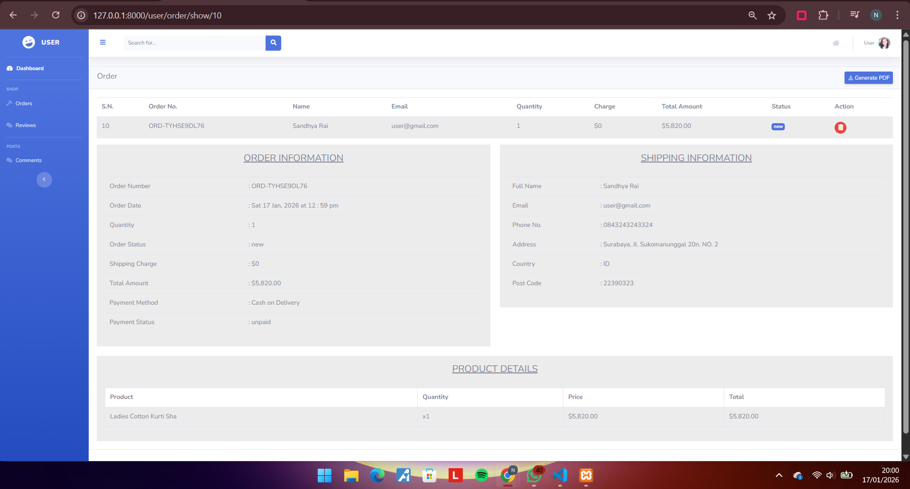
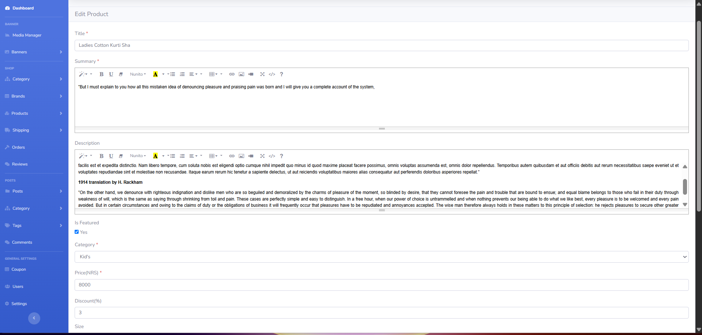
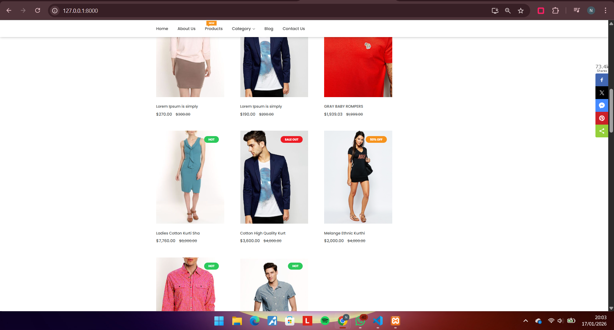
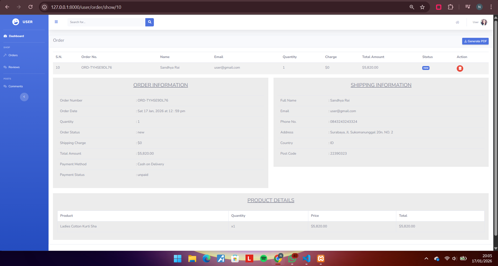
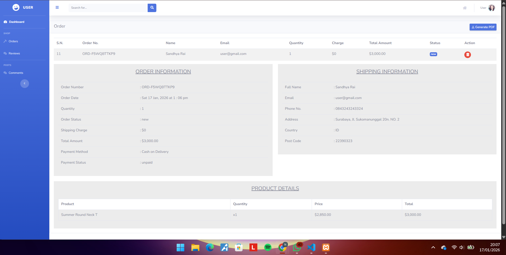
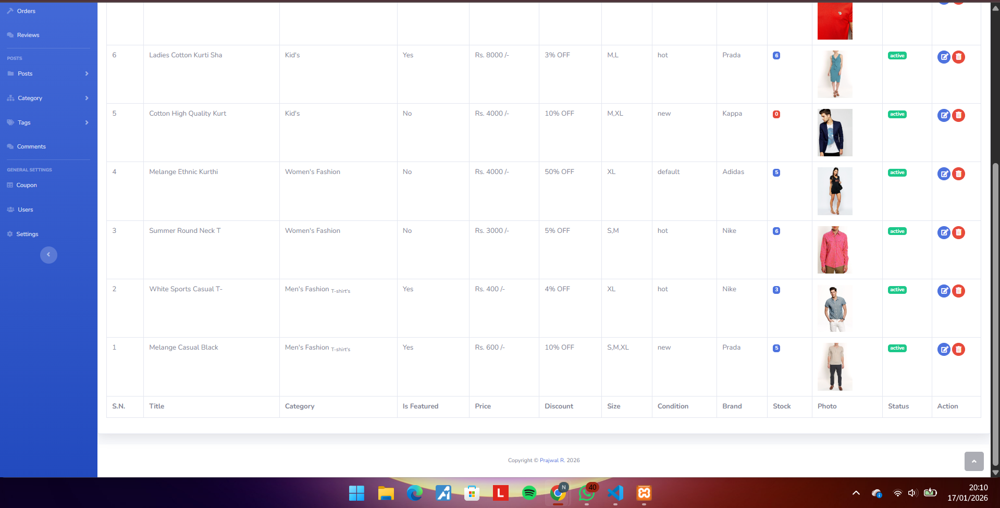
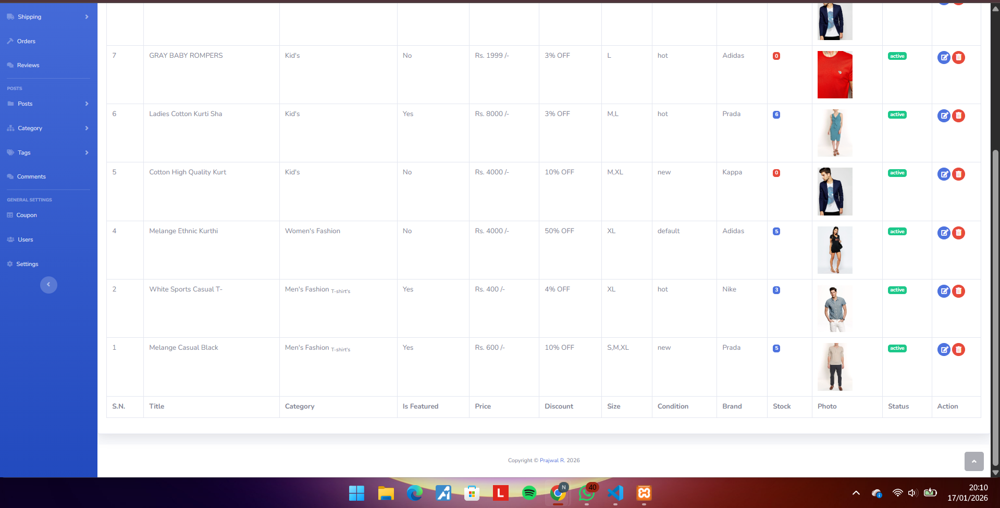
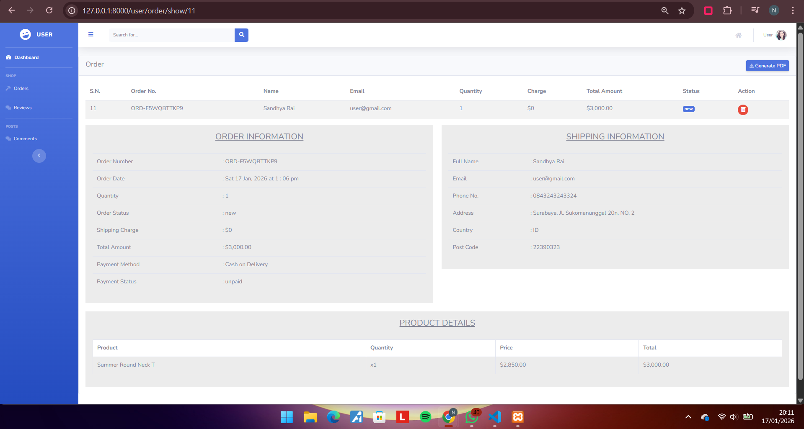

# AI Implementation : https://gemini.google.com/share/8490a71a9c21

Implementation notes. 

Task 1: Order product list integration I added a new section in the order detail view to show the list of products that the user bought. I modified the file resources/views/user/order/show.blade.php by adding a table that displays the product title, quantity, price per item, and the total amount. I also added a check using the null coalescing operator to make sure the page doesn't error if some data is missing.

Task 2: Data integrity and persistence I made sure that the order details do not change even if the admin edits or deletes a product later.

Fixed price logic I changed the code to take the price from the carts table instead of the products table. This is important because the price in the product catalog can change, but the price in the user's order must stay the same as when they first bought it.

Soft deletes implementation I added the SoftDeletes trait to the Product model and created a migration to add the deleted_at column to the products table. In the Cart model, I updated the product relationship by adding the withTrashed method. This way, if an admin deletes a product, the name and info will still appear in the user's order history instead of showing an error.

Suggestion
1. Apply soft deletes to categories and brands Currently, only the products table uses soft deletes. I suggest using this for categories and brands too. This is important because if an admin deletes a category that is still connected to a product, it might cause a blank page or error in the order detail view.

2. Improve database relationships Adding more foreign keys in the migration files would make the database more secure. It ensures that data between orders, carts, and products are always connected properly and prevents data from being lost accidentally.

3. Create a separate table for order history Right now, the system uses the cart table to show product details in the order. It would be better to have a special table like order_items to save the product name and price permanently at the time of purchase. This makes the order history even more safe if there are changes to the product catalog.

4. Notification for deleted products When a product is deleted by the admin, the system should notify users who have that item in their wishlist. Adding a simple status like Discontinued would be a good improvement so the user knows why the product is no longer available.

Proof : 

#Price Integrity (Edit Test)

Before Edit: 

Admin Action: 

After Edit: 

#Data Persistence (Delete Test)

before delete: 

Admin Action: 
 

After delete: 